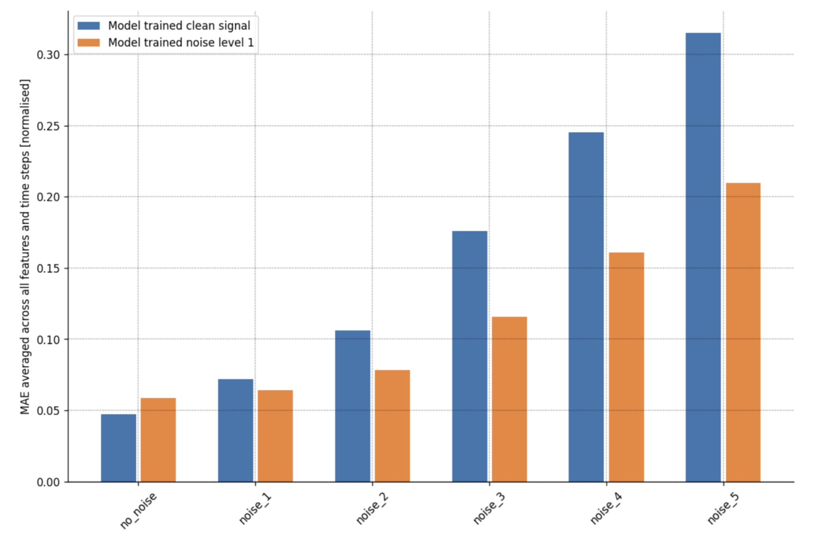

# Predicting the onset of blackouts - rotor angle timeseries forecasting for the IEEE 118 bus model

## Introduction

The frequency and risk of electricity system blackout events are increasing. Extreme weather is one factor contributing to this - a risk which is expected to increase due to climate change. A trend of increased renewable energy sources in the grid is a necessary part of the energy transition, however, this adds greater complexity to grid operations, and with current technologies and grid management practices, can make the grid more vulnerable to blackouts and instability. 

Power system instability is governed by three vectors of stability. These are frequency stability, voltage stability and rotor angle stability. The loss of one or all of these stability vectors can lead to a blackout event. In this project, deep learning was used to forecast the rotor angles in the IEEE 118 bus system over 5 seconds. Time series data was generated using a mathematical model representing the Midwest US. A single fault was simulated on a sample of lines in the system, and time-series data was recorded. 1200 simulations were produced, which were windowed, and split into training, validation and testing sets. 

This data was produced in powerfactory, and the code used to do so can be found in the following repository:

https://github.com/Olliejp/Power_Factory

Rotor angle stability is concerned with the ability of all spinning power generators (coal plants, gas plants, hydro etc), to remain in phase. If a single generator becomes out of phase from another by more than 180 degrees, this machine will typically be tripped from the system. This huge loss of generation to the grid can often be the first step in a series of failures which lead to a blackout. The below figure illustrates rotor angle stability for the generators in the grid model used in this study, this behaviour typically follows a small disturbance in the system, this could be a short circuit on a line (for example a bird could touch two power lines). On the left is a stable case, on the right is an unstable case where a machine accelerates out of phase from the other. This is the behaviour this study aims to predict.

Power systems are so complex that this behaviour cannot be analytically computed in real-time. Further, the time frame between an initial disturbance and a potentially catastrophic system failure can be in the order of hundredths of a second. Deep learning approaches with fast prediction times could therefore be useful in forecasting this behaviour following a grid disturbance. 

## Repo structure

    .
    ├── dataset1_timeseries_forecasting.ipynb    #working notebook for dataset 1
    ├── dataset1_timeseries_forecasting.ipynb    #working notebook for dataset 2
    ├── data_1_2_results.ipynb                   #notebook to present model performance for datasets 1 & 2
    ├── anomaly_detection.ipynb                  #working notebook - anomaly detection of signals using autoencoder
    ├── model_performance_with_noise.ipynb       #notebook to analyse the test accuracy across varying levels of noise
    ├── modules.py                               #functions used across all notebooks to avoid duplication of code
    
## Data processing

Significant data processing steps were conducted which are not included in this repo. The most significant was data windowing. The data windowing function can be found in methods.py. Models were trained on batches of input/output time series window pairs. The below figure illustrates the windowing process used:

 

    
## Model architectures

All models forecast all rotor angles in the system simultaneously in a single shot, over various forecasting lengths. The dataset is multivariate. This is, therefore, a multi-input, multi-output, multi-label time series forecasting problem. 

- baseline, constant prediction from the last data point in input time series window
- Linear model, a single neuron with linear activation
- Dense model with one hidden layer
- 1d Conv model with a single hidden dense layer
- LSTM model
- Bidirectional LSTM model
- Autoencoder
- Encoder/Decoder model

## Description

### dataset1_timeseries_forecasting.ipynb

dataset1_timeseries_forecasting.ipynb and dataset2_timeseries_forecasting.ipynb follow the same workflow, but this notebook formulates the problem more simply. Each model uses the same input features as output features, only shifted in time. Input and output dimensionallity is 14 and 14. The below figure shows how these windows are formulated:

 

### dataset2_timeseries_forecasting.ipynb

This notebook trains models on more complex but realistic dataset windows. Rotor angles are not calculated in real-time operations in power systems. Therefore we train models to predict system rotor angles with raw inputs which could be obtained from signals in real-world operations. This notebook also implements Monte Carlo dropout to estimate model uncertainty. The input/output windows for this dataset are highlighted below, input and output sequence dimensionality are 45 and 14 respectively:

 

### data_1_2_results.ipynb 

Plotting results from the analysis made in the previous two notebooks.

### anomaly_detection.ipynb 

Determining whether data disturbances which could represent cyber attacks can be easily detected by the Encoder/Decoder models autoencoder block.

### model_performance_with_noise.ipynb 

Analysing model performance when Gaussian noise is added to the test set. Also, make a comparison between model trained with a small amount of noise. 

### modules.py

Fuctions used in some or all notebooks to avoid overly duplicated code:

- **normalise_zero_mean**: Normalises features by subtracting mean and dividing by standard deviation
- **normalise_min_max**: Scales feature values between [-1,1]
- **get_feature_or_label_columns_and_indices**
- **get_window**: Creates input/output windowed datasets
- **create_time_steps**: creates a list of timesteps for plotting
- **multi_step_plot**: Creates plot to compare true sequence labels with predictions after model training
- **plot_train_history**: plots training and validation loss from training
- **compile_and_fit**: compiles model before training
- **learning_rate_scheduler**: To find optimum learning rate given a range of epochs and search space

## Results

Model performance on dataset 1:

 

Model performance on dataset 2:

 

Model performance across look forward time horizons of up to 2 seconds (200 time steps):

 

Encoder/decoder model performance comparison when trained with and without additive noise:

 

